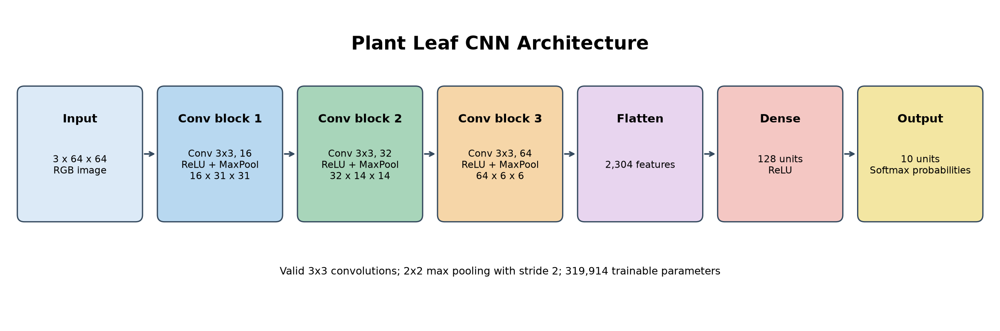
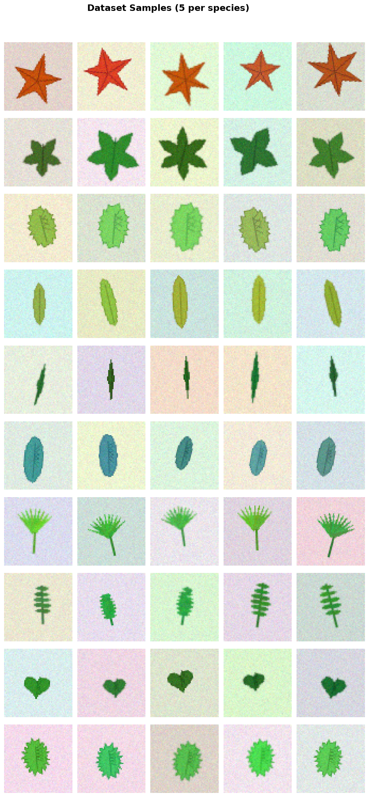
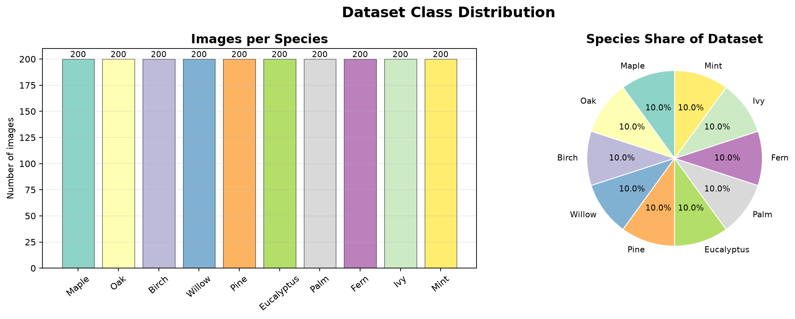
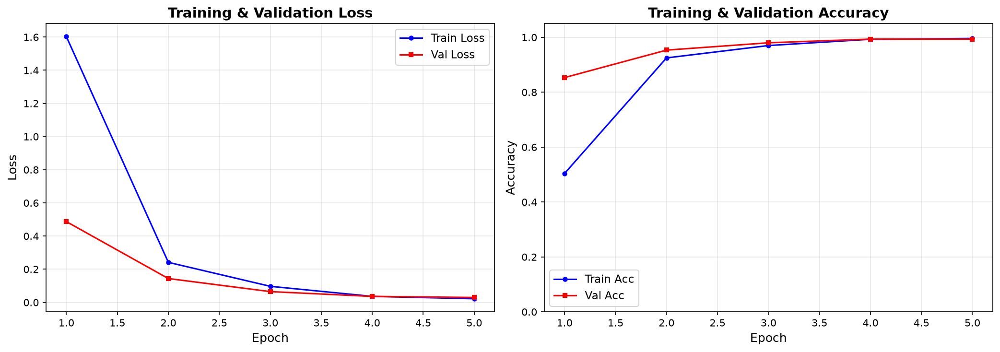
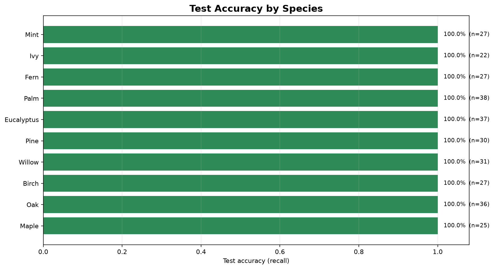
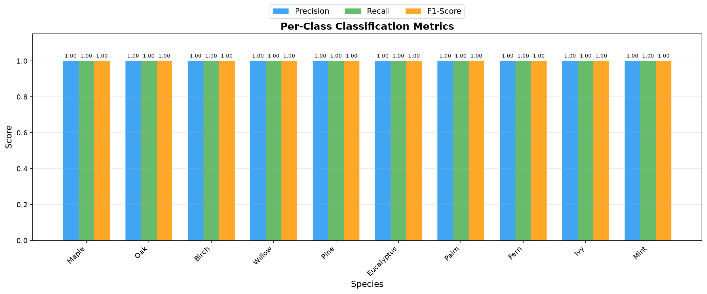
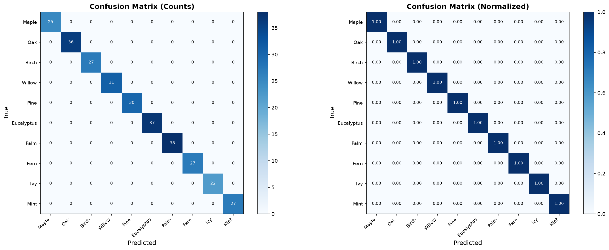

# 🌿 Plant Leaf Classification using CNN

A complete deep learning project that classifies plant species from leaf images using a **Convolutional Neural Network (CNN) built entirely from scratch in NumPy**.

## 📋 Project Overview

| Component | Description |
|-----------|-------------|
| **Dataset** | Synthetically generated leaf images (10 species, 64×64 RGB) |
| **Model** | Custom CNN with 3 conv blocks + 2 dense layers |
| **Framework** | Pure NumPy (no TensorFlow/PyTorch dependency) |
| **Optimizer** | Adam with learning rate decay |
| **Augmentation** | Random flips and brightness adjustments |

## 🌱 Species (10 Classes)

| # | Species | Leaf Characteristics |
|---|---------|---------------------|
| 0 | Maple | Star/palmate shape, warm red-orange colors |
| 1 | Oak | Rounded lobed shape, dark green |
| 2 | Birch | Oval with serrated edges, light green |
| 3 | Willow | Long narrow ellipse, yellow-green |
| 4 | Pine | Needle-like thin shape, dark green |
| 5 | Eucalyptus | Elongated ellipse, blue-green tint |
| 6 | Palm | Fan shape with radiating rays, bright green |
| 7 | Fern | Compound shape with small leaflets |
| 8 | Ivy | Heart/triangular shape, dark green |
| 9 | Mint | Small oval with pronounced serrations |

## 🏗️ CNN Architecture

```
Input (3 × 64 × 64)
    │
    ├─ Conv2D(16, 3×3) → ReLU → MaxPool(2×2)    →  16 × 31 × 31
    ├─ Conv2D(32, 3×3) → ReLU → MaxPool(2×2)    →  32 × 14 × 14
    ├─ Conv2D(64, 3×3) → ReLU → MaxPool(2×2)    →  64 ×  6 ×  6
    │
    ├─ Flatten                                    →  2304
    ├─ Dense(128) → ReLU                          →  128
    └─ Dense(10) → Softmax                        →  10 (probabilities)
```

**Total trainable parameters: 319,914**



## 📁 Project Structure

```
Plant_Leaf_Classification/
├── main.py                 # 🚀 Main entry point - runs full pipeline
├── dataset_generator.py    # 🎨 Synthetic leaf image generator
├── cnn_model.py            # 🧠 CNN model (Conv2D, MaxPool, Dense, etc.)
├── train.py                # 🏋️ Training pipeline with Adam optimizer
├── evaluate.py             # 📊 Evaluation, metrics & visualizations
├── README.md               # 📖 This file
│
├── dataset/plant_leaves/   # Generated after running (auto-created)
│   ├── Maple/
│   ├── Oak/
│   ├── ... (10 species folders)
│   └── metadata.json
│
├── checkpoints/            # Saved model weights (auto-created)
│   └── best_model.pkl
│
└── results/                # Evaluation outputs (auto-created)
    ├── training_curves.png
    ├── confusion_matrix.png
    ├── per_class_metrics.png
    ├── species_accuracy.png
    ├── dataset_distribution.png
    ├── cnn_architecture.png
    ├── dataset_samples.png
    ├── correct_predictions.png
    └── incorrect_predictions.png
```

## 🚀 How to Run

```bash
# Run the complete pipeline using the default 60 images per species
python main.py

# Reproduce the 200-images-per-species experiment documented below
python main.py --samples-per-class 200 --epochs 5
```

Or run individual components:

```bash
# Generate dataset only
python dataset_generator.py

# Train model only
python train.py

# Test model architecture
python cnn_model.py
```

## 📊 Outputs

The evaluation pipeline saves the following report figures in `results/`:

| Figure | What it shows |
|---|---|
| `dataset_samples.png` | Example generated leaves from all ten species |
| `dataset_distribution.png` | Sample counts and proportions by species |
| `cnn_architecture.png` | CNN layers, feature-map dimensions, and output |
| `training_curves.png` | Training/validation loss and accuracy by epoch |
| `confusion_matrix.png` | Test predictions as raw counts and normalized rates |
| `per_class_metrics.png` | Precision, recall, and F1 score for each species |
| `species_accuracy.png` | Per-species test accuracy and number of test samples |
| `correct_predictions.png` | Examples classified correctly |
| `incorrect_predictions.png` | Misclassified examples; created only if errors occur |













## 🔧 Configuration

Edit the `config` dictionary in `main.py`:

```python
config = {
    'samples_per_class': 60,     # Images per species for a faster CPU-friendly run
    'epochs': 5,                 # Training epochs
    'batch_size': 32,            # Mini-batch size
    'learning_rate': 0.001,      # Initial learning rate
    'lr_decay': 0.97,            # LR decay factor per epoch
    'seed': 42,                  # Random seed
    'augment': True,             # Enable data augmentation
}
```

You can also override these at runtime:

```bash
python main.py --samples-per-class 150 --epochs 15 --learning-rate 0.001
```

## 📦 Requirements

- Python 3.8+
- NumPy
- Pillow (PIL)
- Matplotlib
- scikit-learn

## 🧪 Key Concepts Demonstrated

- **Convolution operation** (im2col optimization)
- **Backpropagation** through conv, pool, and dense layers
- **Adam optimizer** implementation
- **Data augmentation** (flips, brightness)
- **He weight initialization**
- **Learning rate scheduling**
- **Model checkpointing** (save/load best model)
- **Comprehensive evaluation** (confusion matrix, precision/recall/F1)

## Project Report

### Dataset

This project creates a **synthetic** image dataset; it does not download real
plant photographs. Each example is a 64 x 64 RGB image containing one centered
leaf on a randomly colored background. Species-specific drawing routines
produce different leaf shapes, colors, and vein patterns. The generator adds
variation in position, size, rotation, background, blur, and pixel noise.

The documented experiment used 200 images for each of 10 species, for 2,000
images total. A fixed random seed of 42 makes generation and splitting
reproducible. Images are saved under `dataset/plant_leaves/`, grouped by
species. `metadata.json` records the class names, image size, sample count, and
seed. The data is split into training, validation, and test partitions.

| Partition | Images | Share |
|---|---:|---:|
| Training | 1,400 | 70% |
| Validation | 300 | 15% |
| Test | 300 | 15% |
| **Total** | **2,000** | **100%** |

### Preprocessing and Training

Image values are converted from 8-bit integers to floating point and scaled to
[0, 1]. The array is rearranged from image-height/image-width/channel order to
channel-first form for the CNN. During training, augmentation randomly flips
images horizontally and adjusts brightness by a factor from 0.85 to 1.15.

The network uses mini-batches of 32 and the Adam optimizer. The documented run
used 5 epochs, an initial learning rate of 0.001, a 0.97 learning-rate decay
per epoch, and seed 42. The checkpoint with the best validation accuracy is
saved as `checkpoints/best_model.pkl`.

### CNN Architecture

The CNN is implemented directly in NumPy. Each convolution uses a 3 x 3 kernel
with valid padding, followed by ReLU and 2 x 2 max pooling with stride 2. The
resulting feature maps pass through flattening, a 128-unit dense layer with
ReLU, and a 10-unit softmax output layer.

| Stage | Output shape (channels x height x width) |
|---|---|
| Input | 3 x 64 x 64 |
| Conv(16) + ReLU + MaxPool | 16 x 31 x 31 |
| Conv(32) + ReLU + MaxPool | 32 x 14 x 14 |
| Conv(64) + ReLU + MaxPool | 64 x 6 x 6 |
| Flatten | 2,304 features |
| Dense + ReLU | 128 features |
| Dense + Softmax | 10 class probabilities |

The model has **319,914 trainable parameters**. Convolution, pooling, dense
layers, softmax, loss, and backpropagation are implemented in the project
rather than delegated to a deep-learning framework. The architecture figure
above is generated by the evaluation pipeline.

### Evaluation Method

The validation set is used during training to select the saved model. The
held-out test set is used for final accuracy, loss, per-species precision,
recall and F1 score, and the confusion matrix. Per-species accuracy in
`species_accuracy.png` is class recall: correctly classified examples of a
species divided by the number of that species in the test set. Precision,
recall, and F1 are also visualized separately for every species in
`per_class_metrics.png`.

### Results

The figures below come from `python main.py --samples-per-class 200 --epochs 5`
with seed 42. Best validation accuracy was **99.33%**. After loading the best
checkpoint, test accuracy was **100.00%** with test loss **0.0258**. Training
accuracy at the final epoch was **99.57%**.

| Species | Test samples | Precision | Recall | F1 score |
|---|---:|---:|---:|---:|
| Maple | 25 | 1.0000 | 1.0000 | 1.0000 |
| Oak | 36 | 1.0000 | 1.0000 | 1.0000 |
| Birch | 27 | 1.0000 | 1.0000 | 1.0000 |
| Willow | 31 | 1.0000 | 1.0000 | 1.0000 |
| Pine | 30 | 1.0000 | 1.0000 | 1.0000 |
| Eucalyptus | 37 | 1.0000 | 1.0000 | 1.0000 |
| Palm | 38 | 1.0000 | 1.0000 | 1.0000 |
| Fern | 27 | 1.0000 | 1.0000 | 1.0000 |
| Ivy | 22 | 1.0000 | 1.0000 | 1.0000 |
| Mint | 27 | 1.0000 | 1.0000 | 1.0000 |
| **Overall** | **300** | **1.0000** | **1.0000** | **1.0000** |

### Interpretation and Limitations

These results show that the model learned to distinguish the visual patterns in
this generated dataset. They should **not** be interpreted as 100% accuracy on
real-world leaf photographs: synthetic examples are simpler and more
consistent than field images, which vary in lighting, camera angle, background,
damage, and within-species appearance. A real-world performance claim requires
testing on a separate, labeled collection of real leaf images that was not used
for training or model selection.

### Generated Artifacts

The saved model is in `checkpoints/best_model.pkl`. Dataset images and metadata
are in `dataset/plant_leaves/`. The evaluation pipeline creates the charts in
`results/`; the architecture, dataset-sample, training-curve, per-species
accuracy, and confusion-matrix figures are embedded in this README for report
writing.
